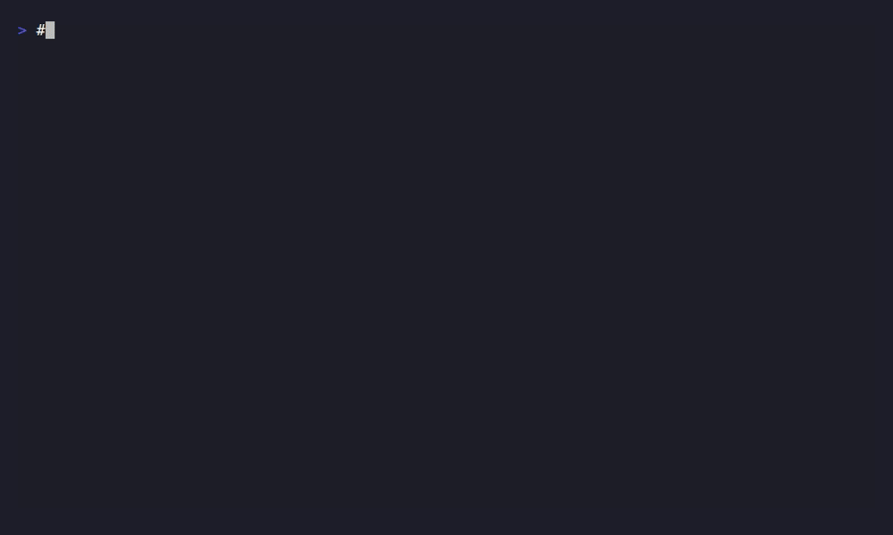

# mockd

[](https://github.com/getmockd/mockd/actions/workflows/ci.yaml)
[](https://go.dev)
[](LICENSE)
[](https://github.com/getmockd/mockd/releases)

**One binary. Seven protocols. Zero dependencies.**

Mock HTTP, gRPC, GraphQL, WebSocket, MQTT, SSE, and SOAP APIs from a single CLI tool. Import from OpenAPI, Postman, WireMock, HAR, or cURL. Share mocks instantly via built-in cloud tunneling.

<p align="center">
  
</p>

## Why mockd?

| | mockd | WireMock | Mockoon | json-server | Prism | MockServer |
|---|:---:|:---:|:---:|:---:|:---:|:---:|
| **Single binary, no runtime** | :white_check_mark: | :x: JVM | :x: Node | :x: Node | :x: Node | :x: JVM |
| **HTTP mocking** | :white_check_mark: | :white_check_mark: | :white_check_mark: | :white_check_mark: | :white_check_mark: | :white_check_mark: |
| **gRPC mocking** | :white_check_mark: | :x: | :x: | :x: | :x: | :white_check_mark: |
| **GraphQL mocking** | :white_check_mark: | :x: | :x: | :x: | :x: | :x: |
| **WebSocket mocking** | :white_check_mark: | :x: | :x: | :x: | :x: | :x: |
| **MQTT broker** | :white_check_mark: | :x: | :x: | :x: | :x: | :x: |
| **SOAP mocking** | :white_check_mark: | :x: | :x: | :x: | :x: | :white_check_mark: |
| **SSE streaming** | :white_check_mark: | :x: | :x: | :x: | :x: | :x: |
| **OAuth/OIDC provider** | :white_check_mark: | :x: | :x: | :x: | :x: | :x: |
| **Chaos engineering** | :white_check_mark: | :white_check_mark: | :x: | :x: | :x: | :x: |
| **Stateful CRUD** | :white_check_mark: | :x: | :white_check_mark: | :white_check_mark: | :x: | :x: |
| **Cloud tunnel sharing** | :white_check_mark: | :x: | :white_check_mark: | :x: | :x: | :x: |
| **Proxy recording & replay** | :white_check_mark: | :white_check_mark: | :white_check_mark: | :x: | :x: | :white_check_mark: |
| **Import OpenAPI/Postman/HAR** | :white_check_mark: | :white_check_mark: | :white_check_mark: | :x: | :white_check_mark: | :white_check_mark: |
| **MCP server (AI-native)** | :white_check_mark: | :x: | :x: | :x: | :x: | :x: |

## Install

```bash
# Quick install
curl -sSL https://get.mockd.io | sh

# Homebrew
brew install getmockd/tap/mockd

# Docker
docker run -p 4280:4280 -p 4290:4290 ghcr.io/getmockd/mockd:latest

# Go
go install github.com/getmockd/mockd/cmd/mockd@latest
```

Pre-built binaries for Linux, macOS, and Windows are available on the [Releases](https://github.com/getmockd/mockd/releases) page.

## Quick Start

```bash
# Start the mock server
mockd start

# Mock an HTTP endpoint
mockd add http --path /api/users --body '[{"id": 1, "name": "Alice"}]'

# Test it
curl http://localhost:4280/api/users
# → [{"id": 1, "name": "Alice"}]

# Mock a GraphQL API
mockd add graphql --path /graphql --operation users \
  --response '[{"id": 1, "name": "Alice"}]'

# Mock a gRPC service
mockd add grpc --proto ./service.proto \
  --service myapp.UserService --rpc-method GetUser \
  --response '{"id": 1, "name": "Alice"}'

# Mock a WebSocket endpoint
mockd add websocket --path /ws/chat --echo

# Import from OpenAPI, Postman, or cURL
mockd import openapi.yaml
mockd import collection.json
mockd import "curl -X GET https://api.example.com/users"
```

## Features

### Multi-Protocol Mocking

Mock **seven protocols** from a single tool with a unified CLI and Admin API:

| Protocol | Port | Example |
|----------|------|---------|
| HTTP/HTTPS | 4280 | `mockd add http --path /api/hello --body '{"msg":"hi"}'` |
| gRPC | 50051 | `mockd add grpc --proto svc.proto --service Greeter --rpc-method Greet` |
| GraphQL | 4280 | `mockd add graphql --path /graphql --operation hello` |
| WebSocket | 4280 | `mockd add websocket --path /ws --echo` |
| MQTT | 1883 | `mockd add mqtt --topic sensors/temp --payload '{"temp":72}'` |
| SSE | 4280 | `mockd add http --path /events --sse --sse-event 'data: hello'` |
| SOAP | 4280 | `mockd add soap --path /soap --operation GetWeather --response '<OK/>'` |

### Import & Export

Bring your existing API definitions — no rewriting needed:

```bash
mockd import openapi.yaml           # OpenAPI 3.x / Swagger 2.0
mockd import collection.json        # Postman collections
mockd import recording.har          # HAR files
mockd import wiremock-mapping.json  # WireMock stubs
mockd import "curl -X GET https://api.example.com/users"  # cURL commands
mockd export --format yaml > mocks.yaml
```

### Cloud Tunnel

Share local mocks with your team instantly. All protocols routed through a single QUIC connection on port 443:

```bash
mockd tunnel enable
# → https://a1b2c3d4.tunnel.mockd.io → http://localhost:4280
```

### Chaos Engineering

Test how your app handles failures:

```bash
mockd chaos enable --latency 500ms --error-rate 0.1 --error-code 503
```

### Stateful Mocking

Simulate CRUD resources with automatic ID generation, pagination, and persistence:

```yaml
# mockd.yaml
statefulResources:
  - name: users
    basePath: /api/users
    seedData:
      - { id: "1", name: "Alice", email: "alice@example.com" }
```

```bash
mockd serve --config mockd.yaml

# POST creates, GET lists, GET /:id reads, PUT updates, DELETE removes
curl -X POST http://localhost:4280/api/users \
  -d '{"name": "Bob"}' -H 'Content-Type: application/json'
# → {"id": "2", "name": "Bob", "createdAt": "..."}
```

### Proxy Recording

Record real API traffic and replay it as mocks:

```bash
mockd proxy start --port 8888
# Configure your app to use http://localhost:8888 as proxy
# Traffic is recorded, then replay with:
mockd import recordings/session-name.json
```

### Admin API

Full REST API for dynamic mock management at runtime:

```bash
# Create a mock
curl -X POST http://localhost:4290/mocks \
  -H "Content-Type: application/json" \
  -d '{"type":"http","http":{"matcher":{"method":"GET","path":"/health"},"response":{"statusCode":200,"body":"{\"status\":\"ok\"}"}}}'

# List mocks
curl http://localhost:4290/mocks

# Import OpenAPI spec
curl -X POST http://localhost:4290/import \
  -H "Content-Type: application/x-yaml" \
  --data-binary @openapi.yaml
```

### AI Mock Generation (MCP)

mockd includes a built-in [Model Context Protocol](https://modelcontextprotocol.io/) server. AI assistants can create, update, and query mocks directly:

```bash
mockd mcp  # Start the MCP server (stdio transport)
```

### Configuration

Configure via flags, environment variables, or config files:

```yaml
# .mockdrc.yaml
port: 4280
adminPort: 4290
httpsPort: 5280
maxLogEntries: 1000
```

| Variable | Description | Default |
|----------|-------------|---------|
| `MOCKD_PORT` | Mock server port | `4280` |
| `MOCKD_ADMIN_PORT` | Admin API port | `4290` |
| `MOCKD_HTTPS_PORT` | HTTPS port (0=disabled) | `0` |
| `MOCKD_CONFIG` | Config file path | |

## Documentation

**[mockd.io](https://mockd.io)** — Full documentation, guides, and API reference.

## Contributing

See [CONTRIBUTING.md](CONTRIBUTING.md) for development setup and guidelines.

## License

[Apache License 2.0](LICENSE)
